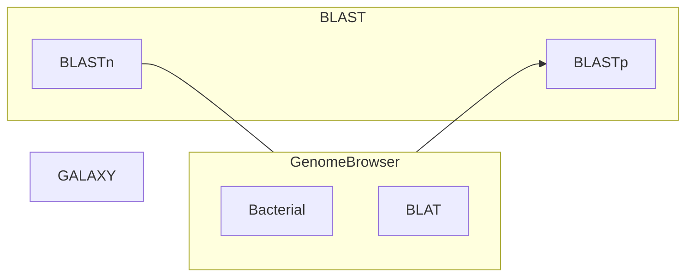

# Biomap

```mermaid
flowchart LR;
		
    BLASTn --- GenomeBrowser
    GenomeBrowser --> BLASTp
    subgraph GenomeBrowser
	    Bacterial
	    BLAT
	  end

		subgraph BLAST 
			BLASTn
			BLASTp
		end
	  GALAXY
    click GALAXY "http://www.github.com" "Shell commands on the web"
```
